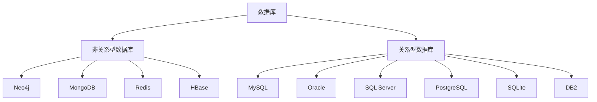

# MySQL 入门教程

在现代 web 应用中，数据是至关重要的。每一个应用的数据都存储在数据库中，MySQL 作为最流行的关系型数据库之一，被广泛应用于 web 应用中。

本教程将介绍 MySQL 的基本概念和用法，包括如何安装 MySQL、如何创建数据库、如何创建表、如何插入数据、如何查询数据等。

## 数据库

数据库(DataBase, DB)的概念，其实没有一个完全固定的定义。按照比较普遍的说法来看，数据库是一个长期存储在计算机内的、有组织的、有共享的、统一管理的数据集合。根据存储数据时所用数据模型的不同，数据库主要分为两种：关系型数据库和非关系型数据库

